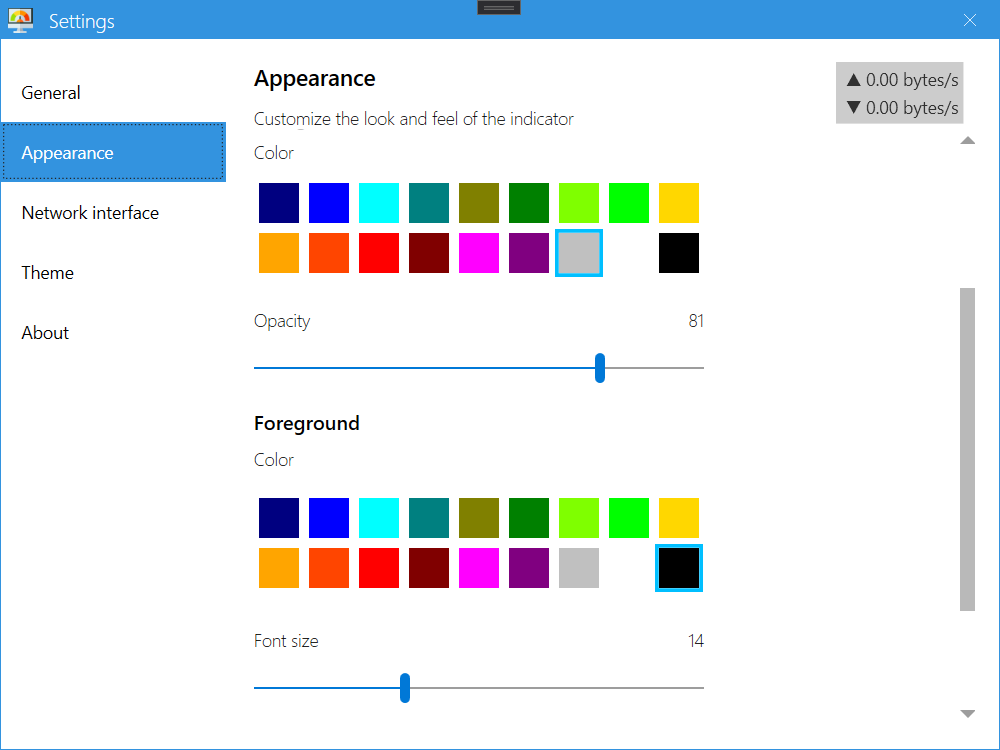

# Net Speed Indicator

## Features

#### Overlay Widget

* A small rectangular box that displays Uploads/Downloads speed in Desktop screen
* Draggable
* Runs in the background, in the system tray
* Right-click Context Menu
  * Settings : Opens settings window
  * Toggle Always on top
  * About
  * Exit

#### Settings Window

* Side bar with Navigation menu
  * General
    * Remember widget's position on the screen
    * Always on Top of other windows
    * Run at start-up
    * Change display unit

  * Appearance
    * Font Size
    * Data Speed to show : Downloads & Uploads
    * Background color
    * Font color
    * Transparent

  * Network Adapter
    * Change network adapter
    * Or autoselect network adapter

  * Theme
    * Light or Dark
  
  * About

### Screenshots

